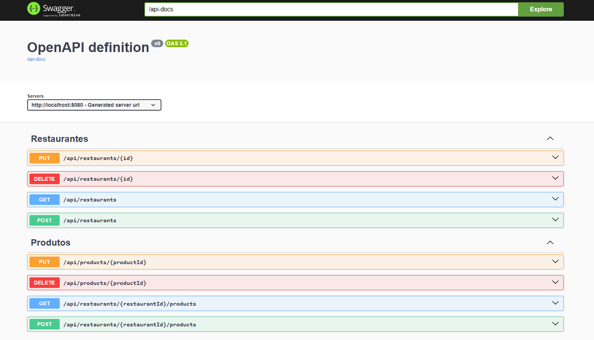

# Broka - API de Food Delivery


## 📖 Sobre

Este projeto é o backend de uma aplicação de entrega de comida, apelidado de "Broka", inspirado em plataformas como o iFood. Foi desenvolvido como um projeto de estudo para aplicar e aprofundar conhecimentos em tecnologias de backend, incluindo o ecossistema Spring, mensageria com RabbitMQ e containerização com Docker.

A aplicação é um monolito contido em um monorepo, seguindo uma arquitetura de serviços.

## ✨ Funcionalidades

✅ **Autenticação e Autorização:** Sistema completo de registro e login com JWT, com diferentes papéis de usuário (Cliente, Dono de Restaurante, Admin).\
✅ **Gerenciamento de Restaurantes:** Donos de restaurantes podem realizar operações de CRUD (Criar, Ler, Atualizar, Deletar) em seus próprios estabelecimentos.\
✅ **Gerenciamento de Produtos:** Donos de restaurantes podem gerenciar o cardápio de seus restaurantes.\
✅ **Sistema de Pedidos:** Clientes podem criar pedidos com itens de um restaurante específico.\
✅ **Processamento Assíncrono:** Integração com RabbitMQ para processar notificações de pedidos em segundo plano, sem impactar a performance da API principal.\
🔜 **Fluxo de Pagamento Simulado (Em Desenvolvimento):** Implementação de um fluxo de pagamento com um webhook mockado, preparando a aplicação para uma integração real com gateways como Stripe ou MercadoPago.

## 🛠️ Tecnologias Utilizadas

-   **Linguagem:** Java 17
-   **Framework Principal:** Spring Boot 3.5.3
    -   **Spring Web:** Para a construção de APIs REST.
    -   **Spring Data JPA:** Para persistência de dados.
    -   **Spring Security:** Para autenticação e autorização com JWT.
    -   **Spring AMQP:** Para integração com RabbitMQ.
-   **Banco de Dados:** PostgreSQL
-   **Mensageria:** RabbitMQ
-   **Containerização:** Docker e Docker Compose
-   **Ferramenta de Build:** Maven

## 🏛️ Arquitetura

O projeto segue uma arquitetura de 3 camadas (Controller, Service, Repository) para garantir a separação de responsabilidades.

-   **Controller Layer:** Responsável por gerenciar as requisições HTTP, validar DTOs e interagir com a camada de serviço.
-   **Service Layer:** Onde reside toda a lógica de negócio, regras da aplicação e gerenciamento de transações.
-   **Repository Layer:** Responsável pela comunicação com o banco de dados através do Spring Data JPA.
-   **Segurança:** A segurança é implementada em duas camadas:
    1.  **Nível de Role (`@PreAuthorize`):** Define quais tipos de usuário (roles) podem acessar um endpoint.
    2.  **Nível de Posse (Lógica no Serviço):** Garante que um usuário só possa modificar os recursos que lhe pertencem.

## 🚀 Como Executar o Projeto

### Pré-requisitos

-   [Docker](https://www.docker.com/get-started/)
-   [Docker Compose](https://docs.docker.com/compose/install/)
-   Java 17+ (Apenas para o modo de desenvolvimento híbrido)
-   Maven (Apenas para o modo de desenvolvimento híbrido)

### Método 1: Ambiente Completo com Docker

Este método sobe a aplicação, o banco de dados e o RabbitMQ, todos como contêineres.

1.  Clone este repositório.
2.  Navegue até a pasta raiz do projeto.
3.  Execute o comando:
    ```bash
    docker-compose up --build
    ```
4.  API estará disponível em `http://localhost:8080`.

### Método 2: Ambiente Híbrido

Este método permite rodar a aplicação diretamente da IDE, aproveitando o hot reload e o debugger, enquanto os serviços (Postgres e RabbitMQ) rodam no Docker.

1.  Inicie apenas os serviços externos com Docker:
    ```bash
    docker-compose up -d db rabbitmq
    ```
2.  Abra a pasta do projeto na sua IDE.
3.  Execute a classe principal `BrokaApplication.java`. A aplicação se conectará automaticamente aos serviços rodando nos contêineres.

## 📋 Documentação da API (Swagger/OpenAPI)
A documentação completa e interativa da API é gerada automaticamente usando OpenAPI 3 e pode ser acessada através do Swagger UI.

Com a aplicação rodando, acesse o seguinte link no seu navegador:

http://localhost:8080/swagger-ui.html
Nesta interface, você pode:

Visualizar todos os endpoints disponíveis, com seus respectivos métodos HTTP, parâmetros e corpos de requisição.

Ver os modelos de dados (DTOs) utilizados para requests e responses.

Executar e testar cada endpoint diretamente pelo navegador, incluindo a autenticação via JWT.



## 🗃️ Acessando o Banco de Dados

Com o ambiente Docker rodando, você pode se conectar diretamente ao PostgreSQL usando uma ferramenta como DBeaver, PgAdmin ou o cliente de banco de dados do IntelliJ.

-   **Host:** `localhost`
-   **Porta:** `5432`
-   **Banco de Dados:** `broka_db`
-   **Usuário:** `user`
-   **Senha:** `password`
